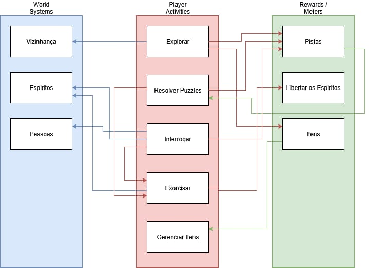
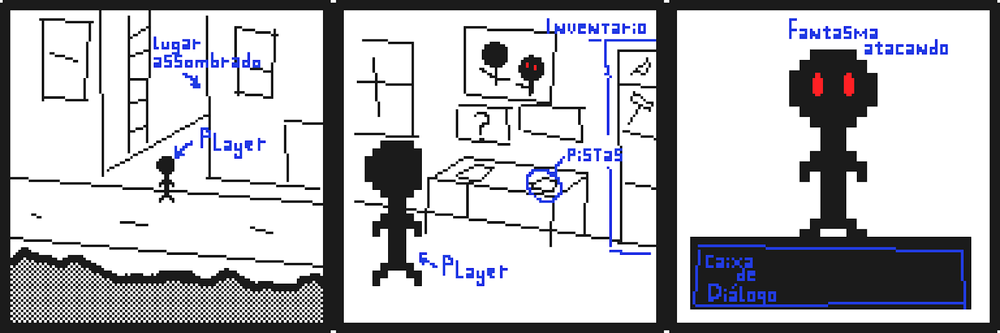

    

# Specter's Case

Um protótipo por: Kodie Sales e Davi Iury

## Essência

Um jogo Point & Click voltado a uma narrativa de mistério e puzzles.

## CoreLoop

O jogador explora o ambiente utilizando o mouse para navegar, encontrando pistas
e resolvendo quebra-cabeças para desvendar o mistério.

## Descrição

Inspirado em jogos de investigação como _L.A. Noire_ e _12 Minutes_, a proposta
principal do jogo é trazer um estilo simples - _Point & Click_ - com uma
narrativa sólida que traz diversos mistérios os quais o jogador deve solucionar
para poder prosseguir na história, ambientada em um mundo onde espíritos são
reais e assombram a vida dos humanos. O jogador está investigando uma região que
teve recentes relatos de assombração, e deve investigar o paradeiro do espírito
e exorcizá-lo.

### História

A protagonista Pam, recém se formou como uma Investigadora Paranormal e recebeu
seu primeiro caso. A vizinhança de _Frost Hollow_ recentemente têm reportado um
número grande de ocorrências paranormais e precisa da sua ajuda. Investigue a
vizinhança e interrogue seus habitantes para descobrir a origem das atividades
anormais e libertar essa comunidade dos espíritos que a assombra.

### Mecânica

Utilizando o mouse para explorar os ambientes e interagir com os objetos à sua
volta, você encontrará nos arredores de _Frost Hollow_, pistas e puzzles a
resolver. Para entender o mistério dessa vizinhança e exorcizar o mal que a
assombra, utilize as pistas que tem e os depoimentos dos moradores que
interrogar.

### Estética

Um jogo _Point & Click_ em _Pixel Art_, com uma ambientação semelhante a _Enigma
do Medo_ e _Shadows of Doubt_, seguindo uma estética _Noir_. O desenvolvimento
da estética tem como principal visão a construção de um ar de mistério pelos
ambientes do jogo, além de um ar sombrio, com uma escolha de paleta de cores
mais escuras e “mortas”, de forma que cause ao jogador um sentimento de dúvida,
angústia e medo, mas ao mesmo tempo curiosidade para explorar e descobrir os
mistérios que o jogo guarda. O jogo _The Last Door_ possui um estética em _Pixel
Art_ mais voltada para o suspense que encaixa bem em como queremos propor, os
cenários mais escuros, um estilo 2D mas ainda incluindo uma ilusão de
profundidade e uma composição que demonstra essa sensação de suspense no ar.

### Tecnologia

Jogo de PC 2D, feito na Godot Game Engine, o mouse como principal controle no
jogo, acessível a dispositivos fracos devido a sua estética mais simples.

## StoryBoard

