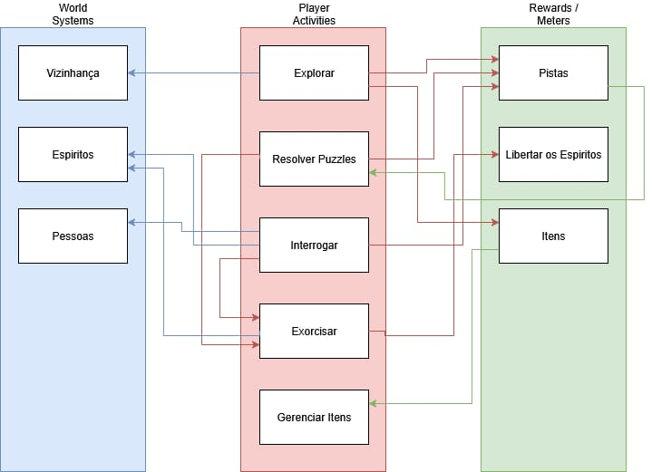
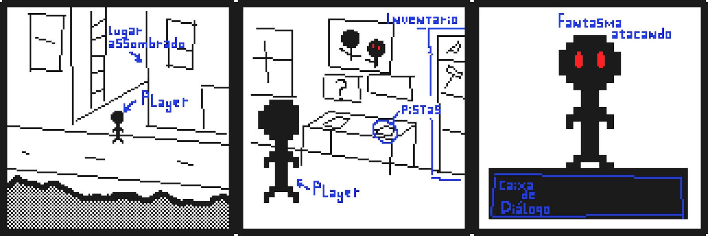

    

# Specter's Case

Um protótipo por: Kodie Sales e Davi Iury

## Essência

Um jogo Point & Click voltado a uma narrativa de mistério e puzzles.

## CoreLoop

O jogador explora o ambiente utilizando o mouse para navegar, encontrando pistas
e resolvendo quebra-cabeças para desvendar o mistério.

## Descrição

Inspirado em jogos de investigação como _L.A. Noire_ e _12 Minutes_, a proposta
principal do jogo é trazer um estilo simples - _Point & Click_ - com uma
narrativa sólida que traz diversos mistérios os quais o jogador deve solucionar
para poder prosseguir na história, ambientada em um mundo onde espíritos são
reais e assombram a vida dos humanos. O jogador está investigando uma região que
teve recentes relatos de assombração, e deve investigar o paradeiro do espírito
e exorcizá-lo.

### História

A protagonista Pam, recém se formou como uma Investigadora Paranormal e recebeu
seu primeiro caso. A cidade de _Quillbrook_ recentemente têm reportado um
número grande de ocorrências paranormais e precisa da sua ajuda. Investigue a
cidade e interrogue seus habitantes para descobrir a origem das atividades
anormais e libertar essa comunidade dos espíritos que a assombra.

### Mecânica

Utilizando o mouse para explorar os ambientes e interagir com os objetos à sua
volta, você encontrará nos arredores de _Quillbrook_, pistas e puzzles a
resolver. Para entender o mistério dessa vizinhança e exorcizar o mal que a
assombra, utilize as pistas que tem e os depoimentos dos moradores que
interrogar.

### Estética

Um jogo _Point & Click_ em _Pixel Art_, com uma ambientação semelhante a _Enigma
do Medo_ e _Shadows of Doubt_, seguindo uma estética _Noir_. O desenvolvimento
da estética tem como principal visão a construção de um ar de mistério pelos
ambientes do jogo, além de um ar sombrio, com uma escolha de paleta de cores
mais escuras e “mortas”, de forma que cause ao jogador um sentimento de dúvida,
angústia e medo, mas ao mesmo tempo curiosidade para explorar e descobrir os
mistérios que o jogo guarda. O jogo _The Last Door_ possui um estética em _Pixel
Art_ mais voltada para o suspense que encaixa bem em como queremos propor, os
cenários mais escuros, um estilo 2D mas ainda incluindo uma ilusão de
profundidade e uma composição que demonstra essa sensação de suspense no ar.

### Tecnologia

Jogo de PC 2D, feito na Godot Game Engine, o mouse como principal controle no
jogo, acessível a dispositivos fracos devido a sua estética mais simples.

## StoryBoard

## Proto-Personas

### Proto-Persona 1: Clara - Complecionista Curiosa

#### Motivações

- Clara é motivada a completar tudo o que o jogo oferece. Ela quer desbloquear 
  todas as áreas, resolver todos os puzzles e, principalmente, obter todas as 
  conquistas. Para ela, a jornada completa do jogo é mais importante do que apenas
  a história principal.

- Ela valoriza uma progressão clara, onde o jogo recompensa sua dedicação com
  reconhecimento visível de suas conquistas.

- Ela gosta de puzzles desafiadores que exigem raciocínio lógico e atenção aos detalhes.

#### Comportamento em Jogo

- Clara vai explorar meticulosamente cada canto do jogo, procurando itens e
  pistas escondidos. Ela adora analisar todos os detalhes visuais e interagir
  com o mundo.

- Ela sente uma grande satisfação em completar quests secundárias e em
  desbloquear elementos extras do jogo.

#### Frustrações

- Clara não gosta de mecânicas de jogo que não recompensam seu esforço ou que a forçam a seguir um caminho linear sem espaço para exploração.

- Ela fica frustrada se não houver um sistema claro de feedback sobre seu progresso, como uma barra de progresso, metas ou recompensas tangíveis por completar tarefas.

#### Expectativas

- Quer um jogo com uma narrativa envolvente e um mundo rico em detalhes, onde ela possa se perder enquanto busca resolver mistérios.

- A presença de puzzles de dificuldade progressiva, com uma curva de aprendizado que ofereça desafios sem ser frustrante.

- Um sistema de conquistas ou recompensas que valide seu esforço em completar todos os aspectos do jogo.

### Proto-Persona 2: Rafaela - Investigadora Competitiva

#### Motivações
- Rafaela é uma Killer que se interessa por desafios e confrontos. Ela busca vencer de maneira estratégica, dominando os desafios impostos pelo jogo e se destacando através de sua habilidade.

- Ela gosta de se sentir desafiada não apenas por puzzles, mas principalmente por confrontos diretos, que exigem tanto estratégia quanto habilidade.

- Ela valoriza a sensação de controle sobre a situação e a oportunidade de usar sua inteligência e habilidades para superar os desafios, especialmente quando em confronto contra inimigos poderosos ou que exigem um planejamento cuidadoso.

#### Comportamento em Jogo

- Rafaela foca em resolver os mistérios, com a intenção de enfrentar os espíritos de maneira estratégica e eficiente.

- Ela se dedica a aprender as melhores formas de enfrentar os inimigos com o sistema de combate, seja melhorando suas habilidades, ou entendendo os pontos fracos dos espíritos ou entidades.

#### Frustrações

- Rafaela se frustra se o sistema de batalha com NPCs for simplista ou fácil demais.

- Ela pode perder o interesse se as batalhas não forem impactantes ou se o jogo não oferecer variedade de confrontos.

#### Expectativas

- Rafaela espera que o sistema de combate com NPCs seja desafiador e permita uma abordagem estratégica.

- Ela gostaria de ver variedade nos tipos de espíritos ou inimigos, cada um com mecânicas próprias.

## Playtests

[Playtests](./PLAYTESTS.md)
